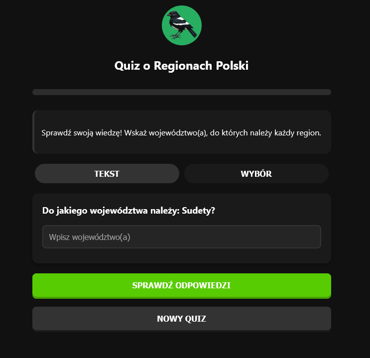

# 🧠 Quiz Województwa — Polska Mapa Wiedzy

Interaktywny quiz online, który sprawdzi Twoją wiedzę geograficzną o województwach Polski. Czy potrafisz przypisać regiony, miasta, rzeki i jeziora do odpowiednich województw?

## 🎮 Funkcje

- ✅ Losowe pytania na temat regionów Polski
- ✍️ Dwa tryby odpowiedzi: **tekstowy** i **wybierany z listy**
- 📊 Prosty system punktacji i podsumowanie wyniku
- 📦 Całość napisana w czystym HTML, CSS i JS — bez frameworków!

## 🖼️ Zrzut ekranu

 <!-- opcjonalnie dodaj screenshot -->

## 🚀 Jak uruchomić

1. Sklonuj repozytorium:

```bash
git clone https://github.com/ItsMaciek/GeographyTest.git
```

2. Otwórz plik index.html w swojej przeglądarce:

```bash
cd nazwa-repo
start index.html
```

## 📂 Struktura projektu
```bash
├── index.html        # Główna strona quizu
├── style.css         # Stylizacja quizu
└── script.js         # Logika quizu (ten plik!)
```


## 🔧 Planowane ulepszenia

 - Dźwiękowe efekty poprawnych i błędnych odpowiedzi


## 📜 Licencja

Projekt na licencji MIT — używaj dowolnie, modyfikuj i rozwijaj!

Powstało z traumy po kartkówkach z geografii i miłości do kodu.
